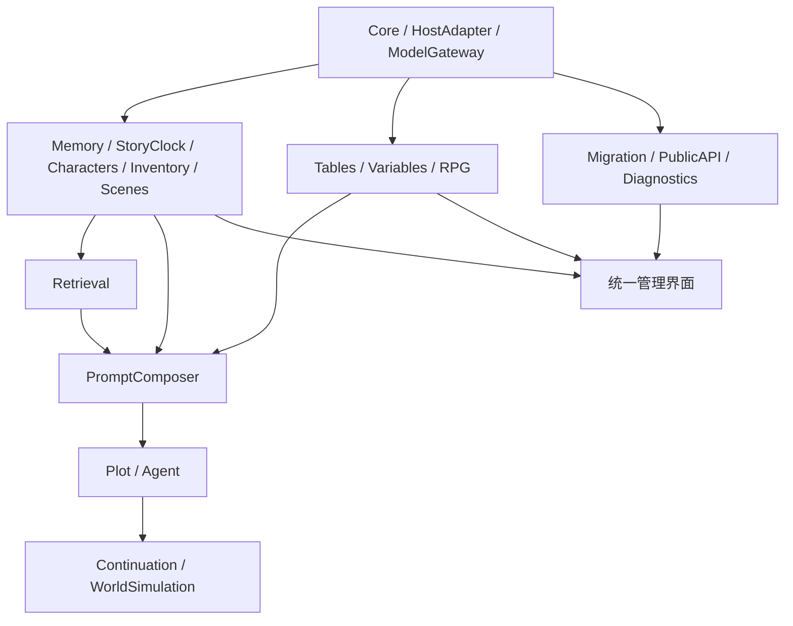

# 新酒馆记忆管理插件：功能覆盖与验收清单 v0.2

日期：2026-10-09。项目方向：重新编写底座，覆盖 Horae、龙血玄黄·数据库、柏宝书的现有功能。

本清单用于开发与验收。P0 底座代码已实现，46 项模拟宿主自动测试通过，18 条 P0 项目在 JSON 中标为 `pending_acceptance`；真实酒馆联调尚未执行，主表勾选框仍保持未通过。其余阶段尚未开始。功能以产品能力分组，相关按钮与参数合并列出；退役功能和未接入当前入口的代码单独登记。

主表共 **148 个开发与验收条目、20 个模块分组**，另有 5 个退役/未接入审查项。条目包含旧插件能力以及新底座要求，不等于 148 个互不重叠的原插件功能。机器可读版本见 [功能覆盖清单.json](H:/下载/ST-cpyoss/功能覆盖清单.json)，可逐项记录设计、开发、验收状态和验证证据。

## 使用方式与范围

- `H`：Horae；`D`：龙血玄黄·数据库（shujuku）；`B`：用户提供的 Rock1069 柏宝书仓库；`N`：为新底座增加的设计要求。
- 来源列中的 `H1/B2/D3` 等对应文末源码证据索引。来源表示存在相关能力，不表示三个项目有完全相同的语义。
- 主表全部纳入最终功能范围。阶段表示开发顺序，不表示删除后期功能；可选模块默认关闭，但最终仍需实现。
- 全部功能独立重写，不同时启动三个旧插件入口。底座、存储协议、调度、变更提交和记忆组装只有一套。
- 能力兼容、数据迁移、第三方接口兼容分别验收。旧模板、预设、主题、脚本不能仅因 JSON 可导入就宣称完全兼容。
- 直接沿用原项目提示词、图标、主题或其他素材前另行确认授权；功能清单不授予素材或源码复用权。

### 固定研究版本

| 项目 | manifest 版本 | 提交 |
| --- | --- | --- |
| [Horae](https://github.com/SenriYuki/SillyTavern-Horae) | 1.15.1 | `7a8859897bbfc6f0781ac5eb2451bc607e2bab95` |
| [龙血玄黄·数据库](https://github.com/AlbusKen/shujuku) | 1.2.9 | `53fbc20813d9d309a9454bc9db9e031e5e2e86d2` |
| [柏宝书：Rock1069 仓库](https://github.com/Rock1069/ST-BaiBai-Book) | 1.2.23 | `ae548e0b225b8adc3843ce5c575d7681801fc918` |

后续上游更新作为新增差异任务处理，不在开发过程中静默改变验收范围。数据库 package.json 的 1.0.0 与 manifest 不一致，此处采用安装 manifest 版本并固定提交。

### 开发阶段

| 阶段 | 条目数 | 交付重点 | 放行条件 |
| --- | --- | --- | --- |
| P0 | 18 | 酒馆适配、存储、身份、调度、事务、回滚 | 基础生命周期及数据恢复通过 |
| P1 | 54 | 摘要、时间、人物、物品、场景、基础编辑和迁移 | 不开向量也能完成长期记忆闭环 |
| P2 | 13 | 检索、注入预算、召回模式和诊断 | 检索来源可查、失败可降级、无重复注入 |
| P3 | 27 | 表格、SQL、变量、RPG、世界书输出 | 所有写入共享提交协议，视图状态一致 |
| P4 | 23 | 剧情规划、Agent、续写、世界推演、正文替换 | 规划与事实分离，任务停止与恢复正确 |
| P5 | 13 | 完整迁移、第三方接口、主题与扩展生态 | 主表逐项验收，兼容差异有明确记录 |

界面与诊断随对应阶段建设，不等到 P5 才能使用。基础 API 配置、数据备份在 P0/P1 就应可用。

### 当前实现进度

已交付原生扩展入口、来源版本与事实库协议、事务、调度、API 渠道、备份与日志。安装说明见 [README](H:/下载/ST-cpyoss/README.md)，详细证据与实机验收步骤见 [P0 实现与验收记录](H:/下载/ST-cpyoss/docs/P0-实现与验收.md)，自动结果见 [p0-validation.json](H:/下载/ST-cpyoss/artifacts/p0-validation.json)。F07 的摘要/检索视图在 P1/P2 接入后验收，F11 的事实编辑界面在 P1 接入；当前交付其底层协议。

## 01. 统一底座与酒馆生命周期

归属：Core + HostAdapter。所有模块依赖本组。

| ID | 功能 | 来源 | 阶段 | 验收要点 |
| --- | --- | --- | --- | --- |
| F01 | [ ] 单一原生扩展入口、宿主就绪检测 | H1/D1/B1/N | P0 | 安装后正常启动；重复初始化不重复绑定事件 |
| F02 | [ ] 单聊、群聊、角色、聊天与分支作用域 | H2/D1/B1/N | P0 | 同名角色及不同群聊不串数据 |
| F03 | [ ] 稳定消息与实体 ID、别名、来源定位 | D1/B1/N | P0 | 删楼导致序号变化后仍定位原实体与依据 |
| F04 | [ ] 唯一事实存储与统一版本协议 | H2/D1/B1/N | P0 | 模块不能各自维护相互矛盾的同一事实 |
| F05 | [ ] 事件增量、检查点、状态重放 | D1/B1/N | P0 | 重启、历史查询与实时状态重放结果一致 |
| F06 | [ ] 原子提交、幂等与重复事件去重 | D1/B1/N | P0 | 同一剧情变化只扣一次物品、不重复添加记录 |
| F07 | [ ] 编辑、删除、重生成、swipe 生命周期 | H1/D1/B2/N | P0 | 摘要、状态和检索视图跟随当前有效版本 |
| F08 | [ ] 任务队列、并发预算、依赖调度 | H1/D2/B2/N | P0 | 重复点击不重复执行；任务顺序与进度可查 |
| F09 | [ ] 取消、超时、重试、迟到结果拒绝 | D2/B2/N | P0 | 切聊天或取消后旧任务不能提交到新聊天 |
| F10 | [ ] 正文、quiet、续写、代写等生成类型隔离 | H1/D2/B2/N | P0 | 内部调用不递归触发摘要、召回和自动推演 |
| F11 | [ ] 人工更正、锁定与模型写入优先级 | H1/D1/B1/N | P0 | 模型无法静默覆盖已锁定的人工作业 |
| F12 | [ ] 模块开关、能力声明、配置版本迁移 | H1/D11/B7/N | P0 | 关闭模块不执行其任务；配置升级可回退 |

## 02. 摘要、压缩与时间线管理

归属：Memory。依赖 F01–F12。

| ID | 功能 | 来源 | 阶段 | 验收要点 |
| --- | --- | --- | --- | --- |
| M01 | [ ] 自动楼层摘要与正文状态提取 | H1/B2/D2 | P1 | 每个有效楼层有覆盖记录；未摘缺口可见 |
| M02 | [ ] 手动补摘、范围扫描、历史批量分析 | H1/B2/D2 | P1 | 范围可选、结果可审阅，中断可继续 |
| M03 | [ ] 详细/精简摘要与提取字段开关 | H1/B7 | P1 | 可按需求调整长度和人物等字段提取 |
| M04 | [ ] 多层摘要压缩与节点关系 | H1/B1/B2 | P1 | 上层摘要可追溯子项，不重复覆盖相同范围 |
| M05 | [ ] 按楼数/token 阈值触发与批次上限 | H1/B7 | P1 | 触发阈值、保留窗口和每批限制分别生效 |
| M06 | [ ] 时间线事件分级、插入、编辑、删除与多选 | H1/H2 | P1 | 普通/重要/关键事件能分别筛选和维护 |
| M07 | [ ] 手动合并压缩、预览、审阅和撤销 | H1/B2 | P1 | 用户可以检查合并结果并恢复原记录 |
| M08 | [ ] 摘要/原始事件切换与节点失效处理 | H1/B1/B2 | P1 | 子项失效后不能继续注入包含它的旧总括 |
| M09 | [ ] 旧消息隐藏、恢复与隐藏归属 | H1/B2/N | P1 | 摘要落盘成功后才隐藏；保留用户手动隐藏 |
| M10 | [ ] 番外、小剧场排除与恢复 | H1/B2 | P1 | 被排除楼不进入状态、摘要和召回 |
| M11 | [ ] 纯摘要模式与结构化模块关闭 | B7 | P1 | 只摘要时不新增人物/物品等结构化变更 |
| M12 | [ ] 内容清洗、标签规则与用户行动结算模式 | H1/B7/D2 | P1 | 思维块等不污染摘要；可识别用户行动来源 |

## 03. 故事时间与历法

归属：StoryClock。依赖 Core；为 Memory/RPG/天气/推演提供统一时间。

| ID | 功能 | 来源 | 阶段 | 验收要点 |
| --- | --- | --- | --- | --- |
| T01 | [ ] 故事日期、时刻、时间段与精度标记 | H2/H4/B1 | P1 | 故事时间与真实保存时间分别记录 |
| T02 | [ ] 相对时间与经过时长 | H4/B4 | P1 | 昨天、上周等均根据当前故事时间计算 |
| T03 | [ ] 自定义月份、月长及架空日期 | H1/H4 | P1 | 不把架空历法强行解析成公历日期 |
| T04 | [ ] 缺失时间、时间跳跃、倒叙与手动纠正 | H4/B4/N | P1 | 未知保持未知；倒叙不误覆盖当前时间 |
| T05 | [ ] 时间标签、自动解析与发送前补全 | H1/B4 | P1 | 补全可关闭；不会静默改写无依据的历史 |
| T06 | [ ] 年龄与时间锚点关联 | H2/B1 | P1 | 时间推进后年龄正确；未知锚点不猜测 |

## 04. 人物、关系、认知与偏好

归属：Characters + Knowledge。依赖 Core/StoryClock。

| ID | 功能 | 来源 | 阶段 | 验收要点 |
| --- | --- | --- | --- | --- |
| C01 | [ ] 主角/NPC 身份、外貌、性格与经历 | H2/D1/B1 | P1 | 同名不同人可区分，字段更新有来源 |
| C02 | [ ] 当前衣着、身体状况与情绪 | H2/B1 | P1 | 当前状态与历史记录分开，不互相覆盖 |
| C03 | [ ] 在场、附近、离场、随行与位置 | H2/B1 | P1 | 全部视图与注入共享同一在场判断 |
| C04 | [ ] 核心角色分级、星标、置顶和筛选 | H1/B1 | P1 | 重点角色可常驻，路人可精简 |
| C05 | [ ] 数值好感与定性内心/外在态度 | H2/B4 | P1 | 数值和五档估计分别保存；未知不等于中性 |
| C06 | [ ] 人物之间的关系网络 | H2/B4 | P1 | 关系方向、对象与依据可查，不跨人合并 |
| C07 | [ ] 关键事实 ID、认知来源与传播 | B4 | P1 | 亲历、听说、怀疑、不知可区分 |
| C08 | [ ] 按角色约束认知注入 | B4/N | P1 | 私密谈话不会因进入摘要而让所有角色知情 |
| C09 | [ ] 人物偏好、习惯与近况档案 | B4 | P1 | 按人物保存；一次行为不自动固化为习惯 |
| C10 | [ ] 角色成长与里程碑 | B1/B4 | P1 | 里程碑可编辑、筛选并追溯对应楼层 |

## 05. 物品、约定与悬念

归属：Inventory + Threads。依赖 Core/Characters/StoryClock。

| ID | 功能 | 来源 | 阶段 | 验收要点 |
| --- | --- | --- | --- | --- |
| I01 | [ ] 物品 ID、名称、描述、数量与单位 | H2/D1/B1 | P1 | 同名独立物品可区分；数量与单位不混淆 |
| I02 | [ ] 持有人、随身、寄存、转移与存放位置 | H2/B1 | P1 | 转移只提交一次，界面与注入位置一致 |
| I03 | [ ] 获得、消耗、删除、归零与变动日志 | H2/B1 | P1 | 相同动作不重复结算，撤回能恢复前态 |
| I04 | [ ] 普通/重要/关键物品与条件注入 | H2/B2 | P1 | 关键物品保留；寄存物品按地点选择发送 |
| I05 | [ ] 约定、任务、期限、伏笔、悬念与核销 | H2/D1/B1 | P1 | 完成、取消和失效可区分，不反复复活旧事项 |

## 06. 场景、地图与天气

归属：Scenes + Weather。天气为可选模块，默认关闭。

| ID | 功能 | 来源 | 阶段 | 验收要点 |
| --- | --- | --- | --- | --- |
| S01 | [ ] 地点层级、地图树、别名与名称复用 | H2/B1 | P1 | 重访同地不会重复建节点 |
| S02 | [ ] 场景固定特征与当前场景焦点 | H2/B1 | P1 | 固定布局与本轮氛围分别更新 |
| S03 | [ ] 场景匹配、按位置发送与手工维护 | H2/B2 | P1 | 只发送相关场景，未知位置有明确状态 |
| S04 | [ ] 天气分类/组合、自定义、自动间隔与固定模式 | B6 | P3 | 按故事时间到期；固定模式不调用天气 AI |

## 07. RPG 系统

归属：RPG。可选模块，默认关闭；读写 Core 的事实与标准变更。

| ID | 功能 | 来源 | 阶段 | 验收要点 |
| --- | --- | --- | --- | --- |
| R01 | [ ] 自定义 HP/MP/SP 等属性条 | H1/H2 | P3 | 名称、颜色、上限与当前值可配置 |
| R02 | [ ] 状态异常、Buff 与效果显示 | H1/H2 | P3 | 添加/解除有来源，图标与文本含义一致 |
| R03 | [ ] 多维属性、雷达与文字显示 | H1/H2 | P3 | 自定义维度与两种显示共用同一数据 |
| R04 | [ ] 技能归属、等级、描述与手工编辑 | H2 | P3 | 技能属于正确实体并支持撤回更新 |
| R05 | [ ] 装备格位、种族模板和自定义模板 | H1/H2 | P3 | 装备与物品关联，不生成两件冲突副本 |
| R06 | [ ] 势力声望、细项、范围与变动 | H1/H2 | P3 | 不同势力独立，超出配置范围可检查 |
| R07 | [ ] 等级、经验、升级规则与进度 | H1/H2 | P3 | 可表达原有规则；同一奖励不重复发放 |
| R08 | [ ] 币种、兑换比例、据点/基地树 | H1/H2 | P3 | 币种与节点独立维护，导入后层级不丢 |
| R09 | [ ] 骰子面板、HUD、在场/仅主角显示与注入开关 | H1 | P3 | 骰子结果可见；关闭子模块不注入其提示词 |

## 08. 表格、SQL 与 JSON 变量

归属：Tables + Variables。依赖 Core；通用自定义数据与事实投影分别声明。

| ID | 功能 | 来源 | 阶段 | 验收要点 |
| --- | --- | --- | --- | --- |
| D01 | [ ] 自定义表、列、行、说明和更新规则 | H1/D1 | P3 | 表结构可配置，字段身份不依赖显示位置 |
| D02 | [ ] 全局/角色模板与聊天独立实例 | H1/D1/B7 | P3 | 共用模板不造成角色或聊天数据污染 |
| D03 | [ ] 表格 CRUD、坐标显示、撤销与重做 | H1/D5 | P3 | 操作经统一提交，视图与事实同步 |
| D04 | [ ] 行、列、单元格锁定 | H1/D5 | P3 | AI、SQL 和外部 API 都遵守同一锁策略 |
| D05 | [ ] 自动填表频率、上下文深度、批次与跳过规则 | D2 | P3 | 每张表可独立配置并查看更新前沿 |
| D06 | [ ] 手工重填、历史回放与一键追平 | D2 | P3 | 重填与补后缀分开；中断不会留下半次提交 |
| D07 | [ ] 更新组、表依赖与冲突校验 | D1/D2 | P3 | 并发组冲突有明确拒绝或重试结果 |
| D08 | [ ] 模板/指导信息的导入导出与切换 | H1/D1 | P3 | 列改名、隐藏和映射冲突不会误绑定数据 |
| D09 | [ ] SQL 表结构、SQLite 查询与事务修改 | D1/D5 | P3 | DDL 可校验；无效批次不部分修改事实 |
| D10 | [ ] JSON 视图、SQL 视图与稳定表/列/行 ID | D1/D5/N | P3 | 两种访问形式读取同一版本，无双写事实源 |
| D11 | [ ] 原生 table_edit/table_sql 工具填表 | D2/D3 | P3 | 支持渠道可调用；不支持时有明确处理策略 |
| D12 | [ ] JSON 变量树、路径操作与分层模板 | B1/B7 | P3 | 全局/角色/聊天模板不混淆，路径操作可撤回 |

## 09. 记忆检索与召回模式

归属：Retrieval。索引为可重建派生数据，不作为事实存储。

| ID | 功能 | 来源 | 阶段 | 验收要点 |
| --- | --- | --- | --- | --- |
| V01 | [ ] 本地 Worker embedding 与远程提供者 | H3/B3/D3 | P2 | 可分别选择生成向量与保存向量的方式 |
| V02 | [ ] OpenAI/Gemini embedding 适配 | H3/B3 | P2 | 响应、维数、批次与错误类型正确解析 |
| V03 | [ ] 语义、关键词、结构化条件与 BM25 检索 | H3/D3 | P2 | 可独立开关与对比，不把关键词当事实 |
| V04 | [ ] 多查询改写与 RRF 结果融合 | H3/B3/D3 | P2 | 多查询命中能去重，改写失败有基础查询 |
| V05 | [ ] 可选 rerank、全文/摘要档与参数预设 | H3/B3/D3 | P2 | 阈值和条数可检查，实际发送档位可见 |
| V06 | [ ] 经典压缩、纯向量、LLM 精读与混合模式 | D3/H3 | P2 | 四种能力均可用，模式切换不破坏历史数据 |
| V07 | [ ] 按聊天/分支/模型/文本版本隔离索引 | H3/B3/D3/N | P2 | 不兼容模型向量不混算，源修改可重建 |
| V08 | [ ] 去重、窗口排除、缓存与失败降级 | H3/B3/D3 | P2 | 近期已发送正文不重复召回，失败仍可生成 |
| V09 | [ ] 索引进度、增量更新、修复、清理与重建 | H3/B3/D3 | P2 | 缺失/损坏状态可见，重建不改写事实 |
| V10 | [ ] 向量快照、旧档挂载与跨设备存储能力 | H3/B3/D3 | P5 | 明确本地/服务器差别，携带旧档后可验证召回 |

## 10. 提示词组装与上下文预算

归属：PromptComposer。各模块只能提交候选材料，不能各自注入最终正文请求。

| ID | 功能 | 来源 | 阶段 | 验收要点 |
| --- | --- | --- | --- | --- |
| P01 | [ ] 状态、时间线、摘要、召回统一组装 | H1/B2/D4/N | P1 | 同一事件和状态不被三套提示重复发送 |
| P02 | [ ] 角色、物品、关系、RPG 等分项开关 | H1/B7 | P1 | 记录与展示可保留，但关闭的分项不注入 |
| P03 | [ ] 位置、深度、角色与顺序配置 | H1/B2/D4 | P2 | 可检查最终位置；不同宿主能力明确降级 |
| P04 | [ ] 总预算、模块配额与截断规则 | H1/B3/D3/N | P2 | 优先保留当前状态，截断不产生残缺结构 |
| P05 | [ ] 实际注入预览、来源与 token 估计 | H1/B3/D11/N | P1 | 显示提交材料；估计与实际计数明确区分 |
| P06 | [ ] 提示词编辑、预设、宏与语言设置 | H1/B7/D2 | P1 | 编辑、导入、回到默认均可用，禁用模块不运行宏任务 |

## 11. API 渠道与运行配置

归属：ModelGateway + Settings。

| ID | 功能 | 来源 | 阶段 | 验收要点 |
| --- | --- | --- | --- | --- |
| A01 | [ ] 跟随酒馆主 API 或选择独立渠道 | H1/B7/D11 | P0 | 各任务可选择渠道；无配置时显示原因 |
| A02 | [ ] 摘要、压缩、提取、规划、Agent 分配渠道 | H1/B7/D7/D8 | P1 | 任务使用选定渠道并能查看调用来源 |
| A03 | [ ] embedding、rerank、查询改写独立配置 | H3/B7/D3 | P2 | 无需强制共用聊天模型或端点 |
| A04 | [ ] 模型选择、温度、输出限制、流式和参数兼容 | H1/B7/D11 | P1 | 不支持的参数可排除，配置错误可定位 |
| A05 | [ ] 请求队列、429 退避、超时、取消与重试 | H1/B3/D2 | P0 | 重试有上限；取消后不继续消耗队列 |
| A06 | [ ] 主 API 回退策略、工具能力与健康检查 | H1/D2/B7/N | P1 | 不静默改用昂贵渠道；能力检测结果可见 |
| A07 | [ ] 凭据隔离、无密钥导出与配置作用域 | H1/B7/D11/N | P0 | 分享配置不泄露 key；角色配置覆盖有明确顺序 |

## 12. 世界书与外部材料

归属：Worldbook。基础读取 P1；写入与管理 P3/P4。

| ID | 功能 | 来源 | 阶段 | 验收要点 |
| --- | --- | --- | --- | --- |
| W01 | [ ] 角色绑定/手选世界书、条目选择与排除 | B2/B5/D4 | P1 | 选定与排除规则用于实际读取材料 |
| W02 | [ ] 激活扫描、模板渲染与旧宿主降级 | B2/D4 | P1 | 条目 API 缺失时提示能力差异，内容可核查 |
| W03 | [ ] 表格按表/行输出、关键词条目与额外索引 | D4 | P3 | 可配置输出模板、位置、关键词和顺序 |
| W04 | [ ] 条目同步、拥有者标记、清理与仅同步重试 | D4/D2 | P3 | 不删除无关条目；同步失败不重复提交事实 |
| W05 | [ ] txt 材料编码、分段、导入世界书/表格 | D9 | P4 | 乱码可预览纠正；目标条目和表可选择 |
| W06 | [ ] 角色卡、用户设定与世界书材料来源分层 | B5/D4/N | P1 | 设定材料不会直接冒充已发生剧情 |

## 13. 剧情规划与正文优化

归属：Plot + TextRevision。可选模块，自动执行默认关闭。

| ID | 功能 | 来源 | 阶段 | 验收要点 |
| --- | --- | --- | --- | --- |
| L01 | [ ] 手动规划、编辑、下一次生成使用和追加输入 | B5/D3 | P4 | 用户可选择交付方式，事实台账不提前变化 |
| L02 | [ ] 自动规划、同轮缓存、失败放行与交付记录 | B5/D3 | P4 | 同一用户输入重生成不重复规划调用 |
| L03 | [ ] 默认/因果/场景导演/自定义规划策略 | B5 | P4 | 策略可切换，候选与最终选定规划可查看 |
| L04 | [ ] 写实检查、认知边界与主支线偏好 | B5/D3 | P4 | 不预设玩家决定，不复活已核销悬念 |
| L05 | [ ] 世界书邂逅候选与当前条件匹配 | B5 | P4 | 候选不自动变事实，只影响待用规划 |
| L06 | [ ] 多任务预设、顺序、提取标签与宏映射 | B5/D3 | P4 | 导入可保留顺序，未知字段有兼容说明 |
| L07 | [ ] 正文替换、标签筛选、对比、测试与自动应用 | D10 | P4 | 测试不写聊天；应用后记忆有明确更新策略 |

## 14. Agent 与世界书控制

归属：AgentRuntime。可选模块，默认关闭；工具写入统一提交。

| ID | 功能 | 来源 | 阶段 | 验收要点 |
| --- | --- | --- | --- | --- |
| G01 | [ ] Agent 角色、提示词、工具与循环预算 | D6/D7/D8 | P4 | 迭代、读数、派工、并发和 token 限额生效 |
| G02 | [ ] 资料目录、按需精读、证据引用与工具结果 | D6/D7/D8 | P4 | 引用能定位实际材料，不凭空声明已读取 |
| G03 | [ ] 世界书 Skill 元信息与排序/选择 | D6 | P4 | 元信息可手工编辑，停用后可恢复原配置 |
| G04 | [ ] 关闭/被动/接管模式与绿灯恢复 | D6 | P4 | 接管只修改目标范围；退出恢复原条目状态 |
| G05 | [ ] 子任务委派、角色渠道、原生/文本工具协议 | D6/D7/D8 | P4 | 结果归属当前任务；失败与拒绝可追溯 |

## 15. 智能续写

归属：Continuation。可选模块，默认关闭。

| ID | 功能 | 来源 | 阶段 | 验收要点 |
| --- | --- | --- | --- | --- |
| U01 | [ ] 续写目标、分卷/阶段大纲与审阅 | D7 | P4 | 用户可查看和修订计划后执行 |
| U02 | [ ] 单轮指令、节奏与故事时间推进 | D7 | P4 | 日常/压力/转折/余波可配置，轮次可追踪 |
| U03 | [ ] 委托酒馆正文生成与唯一回合归属 | D7 | P4 | 一轮只认领一条结果，拒绝/失败不会重复发楼 |
| U04 | [ ] 停止、恢复、重试、阶段/时长上限 | D7 | P4 | 达到上限停止；刷新后能恢复明确状态 |
| U05 | [ ] 重新规划、终审与可选网页资料研究 | D7 | P4 | 完成前缀不被重写；外部资料保留来源 |

## 16. 世界推演

归属：WorldSimulation。可选模块，默认关闭，与正文事实标明作用域。

| ID | 功能 | 来源 | 阶段 | 验收要点 |
| --- | --- | --- | --- | --- |
| Y01 | [ ] 场外时钟、世界维度和动态趋势 | D8 | P4 | 世界时钟与正文故事时间关系明确 |
| Y02 | [ ] 事件种子、幕后人物、目标与长期行动 | D8 | P4 | 状态转换和依据可查，死亡角色不无故复活 |
| Y03 | [ ] 流言传播、玩家区域、碰撞与揭露条件 | D8 | P4 | 私密事件只有满足传播/揭露条件才进入正文材料 |
| Y04 | [ ] 世界纪要、错过事件与有限引导信号 | D8 | P4 | 信号不泄露被排除事实，历史能按来源精读 |
| Y05 | [ ] 自动/手动触发、Agent/网页研究、暂停恢复与提交 | D8 | P4 | 部分失败可见，任务不会留下未经确认的半份台账 |

## 17. 管理界面、主题与辅助工具

归属：UI。基础页面从 P1 交付，外观扩展后置。

| ID | 功能 | 来源 | 阶段 | 验收要点 |
| --- | --- | --- | --- | --- |
| E01 | [ ] 统一导航与仪表盘、轻量/进阶/完整界面 | H1/D11/B10 | P1 | 所有模块同一入口，隐藏页面不等于删除数据 |
| E02 | [ ] 桌面/手机适配、长按与触屏表格操作 | H1/D11/B10 | P1 | 窄屏可完成编辑、审阅与任务停止 |
| E03 | [ ] 顶栏、底栏、输入区、悬浮球和楼层面板 | H1/B10 | P1 | 入口独立开关，定位不遮挡发送与编辑 |
| E04 | [ ] 人物/物品/地图/时间线与数据编辑视图 | H1/D11/B10 | P1 | 展示与注入读取同一版本的状态 |
| E05 | [ ] RPG HUD、图表与表格工作台 | H1/D11 | P3 | 模块关闭后隐藏其视图，配置仍保留 |
| E06 | [ ] 日夜主题、视觉编辑、图片装饰和自定义 CSS | H7/B10/D11 | P5 | 样式作用域明确，主题导入有预览和恢复 |
| E07 | [ ] 多语言 UI 与 AI 输出语言 | H1/H6 | P5 | 覆盖原有语言能力；切语言不改实体 ID |
| E08 | [ ] 新手引导、解释、任务进度和错误提示 | H1/D11/B10 | P1 | 无需进入日志也能理解未配置或失败原因 |
| E09 | [ ] 桌宠、工作气泡、外观、位置与静默模式 | D11 | P5 | 状态来自实际任务；关闭装饰不影响记忆 |
| E10 | [ ] 卡片配置档、提示词/主题预设与共享 | H1/D11/B7 | P5 | 切角色时应用方式明确，共享包不含凭据 |

## 18. 迁移、备份与带记忆新对话

归属：Migration + Archive。基本备份 P0；完整迁移 P5。

| ID | 功能 | 来源 | 阶段 | 验收要点 |
| --- | --- | --- | --- | --- |
| X01 | [ ] 当前数据/配置备份、检查点与恢复 | H1/D1/B9/N | P0 | 恢复失败不破坏原数据，包含版本和来源 |
| X02 | [ ] Horae 全字段识别与迁移映射 | H2/B9/N | P5 | NPC/衣着/关系/RPG/表格等不能静默丢弃 |
| X03 | [ ] 柏宝书叶子、压缩森林、增量与旧档导入 | B1/B9/N | P5 | ID 和覆盖关系完整；有效 swipe 规则可检查 |
| X04 | [ ] 数据库表/模板/SQL/checkpoint/delta 导入 | D1/N | P5 | 旧格式、退役隔离槽与表身份均显式映射 |
| X05 | [ ] 手写旧总结导入与覆盖起点 | B2/B9 | P1 | 明确覆盖范围，后续摘要不重复处理已覆盖楼 |
| X06 | [ ] 带状态/摘要/近期正文/旧向量创建新对话 | H1/H3/B9 | P5 | 可连续携带多代旧档，原聊天保持可恢复 |
| X07 | [ ] 迁移预览、冲突解决、未知字段备份与撤销 | N | P1 | 显示丢失项和历史缺口，不宣称未验证的无损迁移 |

## 19. 诊断、维护与性能

归属：Diagnostics。基础日志 P0，完整工具 P2/P5。

| ID | 功能 | 来源 | 阶段 | 验收要点 |
| --- | --- | --- | --- | --- |
| Q01 | [ ] 运行日志、错误分类、筛选与导出 | D11/H3/B3 | P0 | key 脱敏；提示词正文日志须用户主动开启 |
| Q02 | [ ] 摘要覆盖、状态版本、索引健康与任务检查 | B8/D11/N | P1 | 缺口与陈旧数据可见，不被成功提示掩盖 |
| Q03 | [ ] 召回查询、候选分数、过滤原因和注入来源 | H3/B3/D3 | P2 | 能解释某段记忆为何命中或被排除 |
| Q04 | [ ] SQL 控制台、运行时重新加载与性能观察 | D5/D11 | P3 | 重建内存不误删聊天；修改仍沿统一提交 |
| Q05 | [ ] 按范围清理、保留策略与索引垃圾回收 | H3/D1/D3/B3 | P5 | 清理前明确范围，不误删原始正文及无关世界书 |

## 20. 公开接口与第三方兼容

归属：PublicAPI + Compatibility。新 API 早定义，旧兼容层 P5。

| ID | 功能 | 来源 | 阶段 | 验收要点 |
| --- | --- | --- | --- | --- |
| J01 | [ ] 新只读快照、历史查询、覆盖信息与订阅事件 | H1/B8/D5/N | P0 | 返回值不泄露可变引用，缺口可被调用方识别 |
| J02 | [ ] 受控写入、表格 CRUD、锁与版本冲突接口 | D5/N | P3 | 外部写入不能绕过事实来源、锁和提交校验 |
| J03 | [ ] 宏、斜杠命令与原接口兼容适配 | H1/B8/D5 | P5 | 分别列明支持项与差异，不伪造旧插件身份 |
| J04 | [ ] UI 插槽、数据提供者与组件生命周期 | H5 | P5 | render/update/dispose 可用；卸载后无残留监听 |
| J05 | [ ] 旧预设/模板/主题的兼容报告与降级 | H1/B5/D1/N | P5 | 未支持字段明确提示，数据能保留并导出 |

## 退役、未接入与待确认项

这些条目不混入“当前已可用功能”。保留研究记录；需要恢复时另加明确功能 ID。

| 编号 | 发现 | 当前证据 | 清单处理 |
| --- | --- | --- | --- |
| Z01 | 数据库标签隔离功能已退役 | D12 文案明确停用，旧槽位保留兼容读取 | X04 导入旧槽位；新底座用明确 chat/branch 作用域 |
| Z02 | 数据库旧手动合并纪要按钮已停用 | `presentation/triggers/update-trigger.ts` 的函数只提示停用 | M04/M07 提供统一摘要压缩；不复刻死按钮 |
| Z03 | 柏宝书生理档案与生理时间线文件 | 有 `physiology.ts`、`reproductive.ts` 和页面文件；当前页面注册表无对应入口，当前主要类型/应用路径未见接入 | 登记为待核实遗留/实验代码，不宣称当前可用；若要纳入，先定义独立模块和时间语义 |
| Z04 | 柏宝书独立认知页面文件 | 认知业务已进入记忆处理，但当前页面注册表未列独立 knowledge 页 | C07/C08 保留认知能力；新界面可提供独立认知页，不按文件数量重复计功能 |
| Z05 | 数据库飞行模式旧内部命名 | 当前用户模式明确为经典、向量、LLM、交火 | V06 覆盖现行模式；旧模式记录走兼容映射 |

## 底座数据模型草案

以下是建议契约，不是已经实现的存储布局。固定事实来源可以分多个物理容器；关键是统一 ID、版本与提交协议。SQLite 表格、JSON 变量、页面缓存都不能另立未经协调的同一事实版本。

| 对象 | 关键字段 | 约束 |
| --- | --- | --- |
| ChatScope | chatId、groupId、branchId、epoch | epoch 在切聊天/失效时改变，迟到提交须拒绝 |
| MessageVersion | messageId、swipeId、revision、sourceHash、displayIndex | index 仅用于显示；真正依据是稳定 ID 与版本 |
| Entity | entityId、kind、name、aliases、scope | 同名不强制合并，关系引用 entityId |
| Evidence | evidenceId、messageVersion、range、storyTime、origin | 区分正文、用户更正、设定、推测、计划、场外推演 |
| ChangeSet | id、scope、baseRevision、ops、evidenceIds、status | 全批验证和原子提交；有幂等键 |
| StateProjection | revision、asOf、entities、items、relationships 等 | 从已提交事实重建，页面不得直接改投影 |
| StoryTime | calendarId、raw、parsed、precision、sequence | 缺失与架空日期不强行猜测；支持倒叙来源 |
| SummaryNode | id、level、childIds、coverage、text、status | 压缩叙事与结构化状态分离，失效传播可检查 |
| Knowledge | factId、actorId、awareness、evidenceIds | 事实存在不代表所有角色知情 |
| TableSchema/Row | schemaId、columnIds、rowId、locks、mapping | 事实投影表与独立自定义表明确声明 |
| VariableTemplate | templateId、scope、schemaVersion、initialValues | 模板默认值和运行状态分开 |
| RetrievalDocument | docId、sourceRevision、modelId、dimension、scope | 与源事实关联、可删除重建；不同向量空间隔离 |
| Plan/Task | taskId、type、inputVersion、budget、status、outputs | 计划不是事实，续写/推演提交需声明作用域 |
| PromptBundle | generationId、sections、sourceIds、budget、delivery | 记录本次实际提交材料，区分估计与已提交 |
| Archive | formatVersion、provenance、coverage、attachments、hashes | 可验证导入；未知字段原样备份 |

### 必须解决的语义差异

- **swipe**：新核心默认按回复版本隔离事实；数据库旧表格同楼多个 swipe 共享历史，导入时标明“旧共享快照”，不能凭空拆成各页历史。
- **好感**：Horae 数值与柏宝书内心/外在五档估计各保留字段；不自动换算，不把未知当 0。
- **物品**：数量、单位、持有人、同名实例分别建模；迁移最终快照时记录覆盖起点，不能假装有完整逐楼账本。
- **模板作用域**：共享模板、共享初值、共享实时数据分别声明；默认不让全局模板带来聊天状态污染。
- **剧情与场外世界**：正文事实、角色认知、未来规划、场外推演各有来源与可见性；统一存储不代表统一知情。
- **存储提供者**：基础功能无需额外服务端插件；本地向量、服务器向量、跨设备与旧档召回用能力声明标明差别。

## 模块依赖与开发顺序

建议阶段完成顺序：P0 → P1 → P2 → P3 → P4 → P5。每阶段在新增功能之外执行已影响模块的回归验收，不把“页面能打开”当成功能完成。

## 发布前统一验收场景

- [ ] 两个聊天快速切换，后台请求分别返回：没有串写或残留注入。
- [ ] 同一楼多次渲染/重试：只结算一次物品和 RPG 奖励。
- [ ] 在不同回复页之间切换，再删除中间消息：状态、摘要和来源都能正确定位。
- [ ] 已压缩范围内修改正文：陈旧摘要、索引和祖先节点按策略重建或标记，不继续当有效事实发送。
- [ ] 用户手动隐藏一楼、插件隐藏其他楼：关闭摘要功能不恢复用户手动隐藏内容。
- [ ] 人工锁定表格单元格后，AI 填表、SQL、公开 API 分别尝试改写：均遵守同一锁。
- [ ] 关掉 RPG、天气、Agent、自动规划：没有相关任务调用和提示词注入。
- [ ] 无向量、无后端插件、无酒馆助手：基础记忆闭环仍可使用，缺失能力可见。
- [ ] 替换 embedding 模型或正文版本：索引不混算，重建不损坏源事实。
- [ ] 几百楼聊天中的旧约定被相关输入触发：召回有原始依据，已结束悬念不重新开启。
- [ ] 三类旧数据分别导入，再导出恢复：每类字段有迁移结果与缺口记录。
- [ ] 配置分享和日志导出：凭据脱敏；主动开启的正文日志有清楚范围。
- [ ] 连续创建带记忆新聊天：近期正文、结构状态、祖先旧档各自可验证。
- [ ] 自动续写遇到拒绝、网络失败和用户停止：不重复发楼，可解释恢复点。
- [ ] 手机窄屏完成数据纠正、摘要审阅、表格编辑和任务停止。

## 源码证据索引

相对路径均从本工作区 `research/` 开始；以下目录名固定为 horae、shujuku、baibai。证据指向已下载的固定提交。部分清单目标是将相关旧能力统一实现或改进，不是对旧行为逐字复刻。

| 代码 | 入口文件与相关位置 |
| --- | --- |
| H1 | `horae/index.js`（DEFAULT_SETTINGS、公开 API、消息/生成事件、表格/RPG/界面/导入导出）；`horae/manifest.json` |
| H2 | `horae/core/horaeManager.js`（解析、聚合、事件、人物、物品、关系、RPG） |
| H3 | `horae/core/vectorManager.js`、`horae/utils/embeddingWorker.js`、CHANGELOG 的向量快照章节 |
| H4 | `horae/utils/timeUtils.js` 与 `index.js` 的 customCalendar 配置 |
| H5 | `horae/Horae端口系统说明.md` 与 `_publishHoraeApi()` |
| H6 | `horae/README.zh-CN.md`（语言/能力）；`horae/core/i18n.js` |
| H7 | `horae/THEME.md`、`index.js` 的主题编辑与 CSS 控件 |
| B1 | `baibai/src/memory/types.ts`、`store.ts`、`apply.ts`；`src/index.ts` |
| B2 | `baibai/src/memory/engine.ts`、`inject.ts`、`select.ts`；`src/api/settings.ts` |
| B3 | `baibai/src/memory/vector/recall.ts`、`embed.ts`、`store.ts`、`index.ts`、`scope.ts`、`debug.ts` |
| B4 | `baibai/src/memory/knowledge.ts`、`lifeDetails.ts`、`npcRelations.ts`、`timeRel.ts`、`timeTag.ts`；`src/pages/npcs/index.vue` |
| B5 | `baibai/src/plot/model.ts`、`store.ts`、`presets.ts`、`realism.ts`、`demStabs.ts` |
| B6 | `baibai/src/weather/model.ts`、`store.ts` |
| B7 | `baibai/src/api/settings.ts`、`client.ts` |
| B8 | `baibai/PUBLIC_API.md`、`src/public/types.ts`、`query.ts`、`register.ts` |
| B9 | `baibai/src/memory/migrate.ts`、`carryover.ts`；README 的旧总结/带数据新对话说明 |
| B10 | `baibai/src/pages/registry.ts`、`App.vue`、`menu.ts`、`topbar.ts`、`quickReply.ts`、`floorPanel.ts`、`state/ui.ts` |
| D1 | `shujuku/src/entry-extension.ts`、`data/models/chat-message-data.ts`、`shared/models/table-data.ts`；`service/table/storage-frame-v2-types.ts`、`table-write-transaction.ts`、`table-schema-migration.ts` |
| D2 | `shujuku/src/service/table/update-scheduler.ts`、`update-orchestrator.ts`、`table-update-commit.ts`；`presentation-v2/copy/form-fill-copy.ts`；`presentation/bootstrap/init.ts` |
| D3 | `shujuku/src/presentation-v2/copy/fill-mode-copy.ts`；`service/vector/summary-vector-hybrid-retrieval.ts`、`summary-vector-index-types.ts`；`data/gateways/vector-embedding-gateway.ts` |
| D4 | `shujuku/src/service/worldbook/injection-engine.ts` 及其 entries/custom 子模块；`service/worldbook/pipeline.ts` |
| D5 | `shujuku/src/presentation/bootstrap/api-registry.ts` 与 `api-groups/table-crud-api.ts`、`table-lock-api.ts`、`sql-api.ts`、`core-data-api.ts` |
| D6 | `shujuku/src/service/agent/` 的决策、Skill、接管及恢复模块；`presentation/bootstrap/api-groups/agent-worldbook-api.ts` |
| D7 | `shujuku/src/service/continuation/model.ts`、`continuation-orchestrator.ts`、`host-generation-bridge.ts`、`stage-execution-engine.ts` |
| D8 | `shujuku/src/service/simulation/model.ts`、`simulation-orchestrator.ts`、`world-dynamics.ts`、`simulation-projection.ts`、`simulation-transaction.ts` |
| D9 | `shujuku/src/presentation-v2/copy/import-copy.ts`、`pages/ImportPage.vue`；`presentation/triggers/import-process.ts` |
| D10 | `shujuku/src/presentation-v2/copy/content-replace-copy.ts`、`pages/ContentReplacePage.vue`；`service/optimization/content-optimization.ts` |
| D11 | `shujuku/src/presentation-v2/router/page-registry.ts` 与 `copy/dashboard-copy.ts`、`api-copy.ts`、`advanced-tools-copy.ts`、`developer-copy.ts`；`presentation/bootstrap/api-groups/feature-runtime-api.ts` |
| D12 | `shujuku/src/presentation-v2/copy/data-mgmt-copy.ts`、`presentation/triggers/update-trigger.ts`（退役声明） |

记录状态建议：未开始 → 设计已定 → 开发中 → 待验收 → 通过。只有通过对应验收并记录证据后才勾选；涉及兼容的项目同时记录已支持格式与已知差异。
